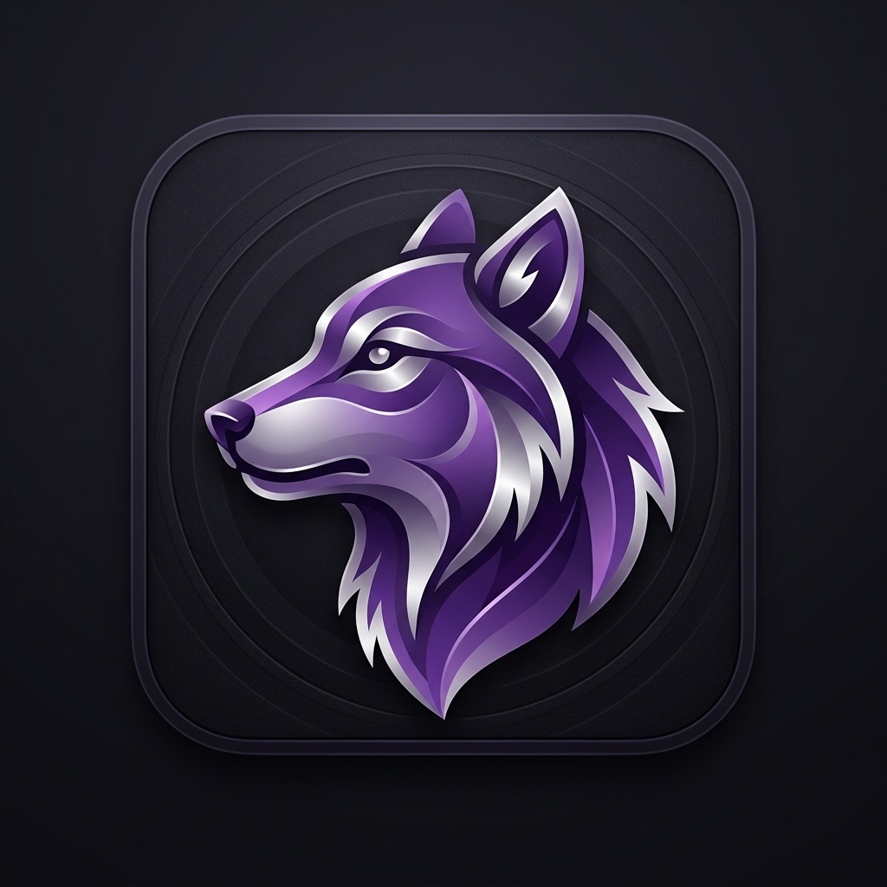

<div align="center">



# 🐺 WERWOLF MOBILE

### _Das ultimative Werwolf-Spiel für dein Handy_

<br>

[](https://emre1001.github.io/Werwolf-Mobile/)
[](https://emre1001.github.io/Werwolf-Mobile/)
[](https://firebase.google.com)
[](LICENSE)
[]()

<br>

> _Spiele das klassische Werwolf-Kartenspiel digital – mit Freunden online oder lokal auf einem Gerät._
> _Echtzeit-Synchronisation, automatischer Erzähler, Chat-System und **10 einzigartige Rollen!**_

<br>

---

</div>

<br>

## ✨ Features

<table>
<tr>
<td width="50%">

### 🌐 Online-Modus
Spiele mit Freunden über das Internet. Jeder auf seinem eigenen Gerät. Echtzeit-Synchronisation über Firebase.

### 🏠 Lokal-Modus
Ein Gerät, ein menschlicher Erzähler. Perfekt für Partys und Spieleabende.

### 💬 Intelligentes Chat-System
- **Tag:** Öffentlicher Chat für alle
- **Nacht:** Privater Werwolf-Chat
- **Tod:** Geister-Chat für Eliminierte

</td>
<td width="50%">

### 🤖 Automatischer Erzähler
Im Online-Modus übernimmt das System die Spielleitung. Kein menschlicher Erzähler nötig.

### 📱 Progressive Web App
Installierbar auf jedem Gerät. Funktioniert wie eine native App mit Offline-Support.

### 🎨 Atemberaubendes Design
Glasmorphismus-UI, Partikel-Hintergrund, flüssige Animationen und Tag/Nacht-Übergänge.

</td>
</tr>
</table>

<br>

## 🎭 Rollen

> Jede Rolle hat eine einzigartige Fähigkeit, die das Spiel spannend und strategisch macht.

<table align="center">
<tr>
<th>Rolle</th>
<th>Fähigkeit</th>
<th>Team</th>
</tr>
<tr>
<td>🐺 <b>Werwolf</b></td>
<td>Wählt nachts gemeinsam mit anderen Wölfen ein Opfer</td>
<td>🔴 Werwölfe</td>
</tr>
<tr>
<td>🏘️ <b>Dorfbewohner</b></td>
<td>Keine Spezialfähigkeit – deine Stimme bei der Abstimmung zählt!</td>
<td>🟢 Dorf</td>
</tr>
<tr>
<td>🔮 <b>Seherin</b></td>
<td>Kann jede Nacht die wahre Rolle eines Spielers aufdecken</td>
<td>🟢 Dorf</td>
</tr>
<tr>
<td>🧪 <b>Hexe</b></td>
<td>Besitzt einen Heiltrank (rettet Opfer) und einen Gifttrank (tötet)</td>
<td>🟢 Dorf</td>
</tr>
<tr>
<td>💘 <b>Amor</b></td>
<td>Bestimmt in der ersten Nacht zwei Liebende – stirbt einer, stirbt auch der andere</td>
<td>🟢 Dorf</td>
</tr>
<tr>
<td>🎯 <b>Jäger</b></td>
<td>Wenn er stirbt, nimmt er einen anderen Spieler seiner Wahl mit</td>
<td>🟢 Dorf</td>
</tr>
<tr>
<td>👧 <b>Kleines Mädchen</b></td>
<td>Kann die Werwölfe ausspionieren – mit 50% Risiko entdeckt zu werden!</td>
<td>🟢 Dorf</td>
</tr>
<tr>
<td>🛡️ <b>Beschützer</b></td>
<td>Schützt jede Nacht einen Spieler vor dem Tod (nicht zweimal denselben)</td>
<td>🟢 Dorf</td>
</tr>
<tr>
<td>👑 <b>Prinz</b></td>
<td>Überlebt die erste Hinrichtung durch das Dorf</td>
<td>🟢 Dorf</td>
</tr>
<tr>
<td>👴 <b>Älteste</b></td>
<td>Überlebt den ersten Werwolf-Angriff</td>
<td>🟢 Dorf</td>
</tr>
</table>

<br>

## 🎮 Spielablauf

<table>
<tr>
<td align="center" width="25%">

### 🌙 Nacht

Das Dorf schläft. Die Werwölfe erwachen und wählen ein Opfer. Spezialrollen führen ihre Aktionen aus.

</td>
<td align="center" width="25%">

### ☀️ Tag

Das Dorf erwacht. Ein Opfer wurde gefunden! Alle diskutieren: Wer könnte ein Werwolf sein?

</td>
<td align="center" width="25%">

### 🗳️ Abstimmung

Das Dorf stimmt ab. Der Spieler mit den meisten Stimmen wird hingerichtet.

</td>
<td align="center" width="25%">

### 🏆 Sieg

**Dorf gewinnt:** Alle Werwölfe eliminiert.
**Werwölfe gewinnen:** Gleich viele oder mehr als Dorfbewohner.

</td>
</tr>
</table>

<br>

## 🚀 Schnellstart

```
1. 🌐  Öffne die Live-Demo → https://emre1001.github.io/Werwolf-Mobile/
2. ✏️  Gib deinen Spielernamen ein
3. 🏠  Erstelle eine Lobby (öffentlich oder privat)
4. 📤  Teile den 6-stelligen Code mit Freunden
5. 👥  Warte auf mindestens 4 Spieler
6. 🎮  Host startet das Spiel – Rollen werden automatisch verteilt!
```

<br>

## 🛠️ Tech Stack

| Technologie | Verwendung |
|-------------|-----------|
| **Vanilla JavaScript** | Gesamte App-Logik, kein Framework |
| **CSS3** | Glasmorphismus, Animationen, Responsive Design |
| **Firebase Firestore** | Echtzeit-Datenbank für Multiplayer-Sync |
| **Canvas API** | Partikel-Konstellations-Hintergrund |
| **Service Worker** | Offline-Support und PWA-Caching |
| **Web App Manifest** | Installierbare Progressive Web App |

<br>

## 📱 Installation

### Als Web-App (empfohlen)

1. Öffne [die Live-Demo](https://emre1001.github.io/Werwolf-Mobile/) im Browser
2. Klicke auf **"App installieren"** oder **"Zum Startbildschirm hinzufügen"**
3. Fertig! Die App erscheint auf deinem Homescreen

### Lokal entwickeln

```bash
# Repository klonen
git clone https://github.com/emre1001/Werwolf-Mobile.git

# In das Verzeichnis wechseln
cd Werwolf-Mobile

# Lokalen Server starten (eine der folgenden Optionen)
npx serve .
# oder
python -m http.server 8000
# oder
php -S localhost:8000
```

> **Hinweis:** Ein lokaler Server ist nötig, da die App ES-Module verwendet.

<br>

## 📋 Projektstruktur

```
Werwolf-Mobile/
├── index.html          # Haupt-HTML mit allen Overlays und Modals
├── style.css           # Komplettes Styling mit Animationen
├── app.js              # Gesamte Spiellogik und Firebase-Integration
├── service-worker.js   # PWA-Caching und Offline-Support
├── manifest.json       # Web-App-Manifest für Installation
├── icon.png            # App-Icon
├── wolf-icon.png       # Wolf-Logo
├── LICENSE             # MIT-Lizenz
└── README.md           # Diese Datei
```

<br>

## 🐛 Bekannte Bugfixes (v2.0)

- **Prompt/Alert ersetzt** → Elegante In-Game-Modals statt Browser-Popups
- **Fisher-Yates Shuffle** → Faire Rollenverteilung
- **Liebende-Mechanik** → Tod des Partners auch bei Nacht-Tod
- **Hexe Online-Modus** → "Fertig"-Button für asynchrones Spiel
- **Doppelte Nacht-Tode** → Korrekte Auflösung der Angriffe
- **Jäger-Rache** → Interaktive Auswahl statt Text-Eingabe

<br>

<details>
<summary><b>🔧 Für Entwickler: Firebase-Setup</b></summary>

<br>

Die App nutzt eine öffentliche Firebase-Konfiguration. Für ein eigenes Setup:

1. Erstelle ein Firebase-Projekt auf [console.firebase.google.com](https://console.firebase.google.com)
2. Aktiviere Firestore Database
3. Ersetze die `firebaseConfig` in `app.js` mit deinen eigenen Werten
4. Setze passende Firestore Security Rules

```javascript
// Beispiel Firestore Rules
rules_version = '2';
service cloud.firestore {
  match /databases/{database}/documents {
    match /lobbies/{lobbyId} {
      allow read, write: if true;
      match /messages/{messageId} {
        allow read, write: if true;
      }
    }
  }
}
```

</details>

<br>

## 🤝 Mitwirken

Pull Requests sind willkommen! So gehst du vor:

1. **Fork** das Repository
2. Erstelle einen **Feature-Branch** (`git checkout -b feature/neue-rolle`)
3. **Committe** deine Änderungen (`git commit -m 'Neue Rolle: Wächter'`)
4. **Push** den Branch (`git push origin feature/neue-rolle`)
5. Erstelle einen **Pull Request**

> Bitte erstelle erst ein [Issue](https://github.com/emre1001/Werwolf-Mobile/issues), bevor du große Änderungen machst.

<br>

## 💖 Unterstützen

Wenn dir das Projekt gefällt, kannst du es unterstützen:

[](https://paypal.me/Emre100120)

<br>

## 📄 Lizenz

Dieses Projekt steht unter der [MIT-Lizenz](LICENSE).

<br>

---

<div align="center">

**Made with 🐺 and ❤️ by [Emre Asik](https://github.com/emre1001)**

_Gib dem Projekt einen ⭐ wenn es dir gefällt!_

<br>

<sub>© 2024-2025 Emre Asik. Alle Rechte vorbehalten.</sub>

</div>
